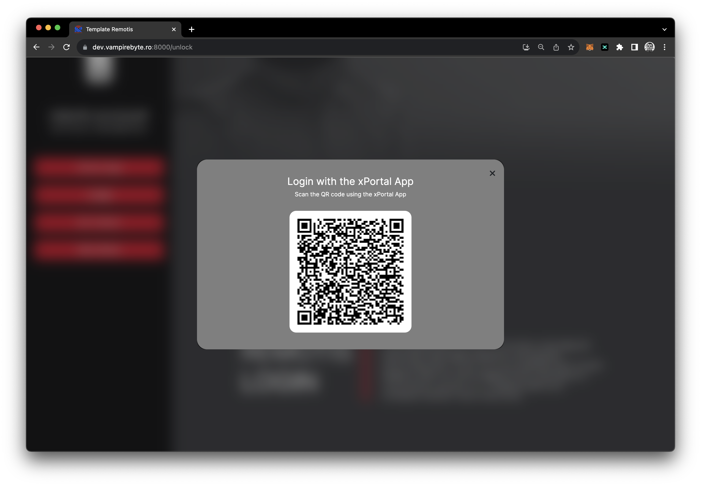
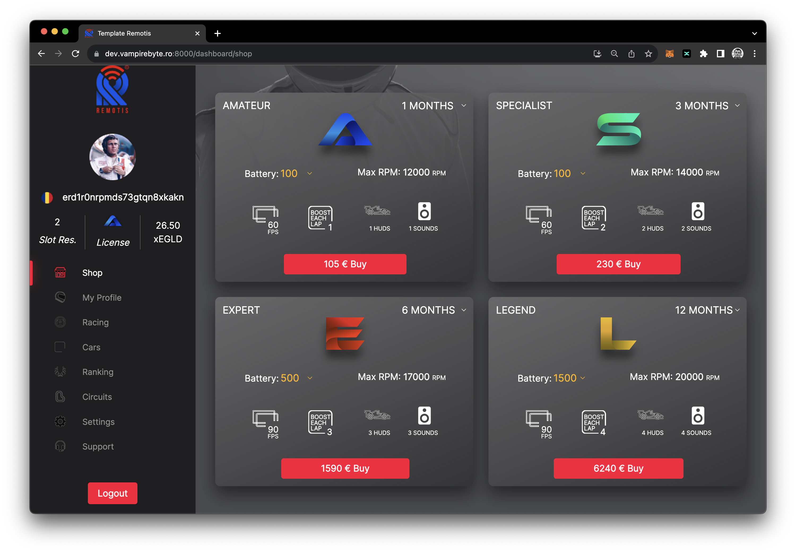
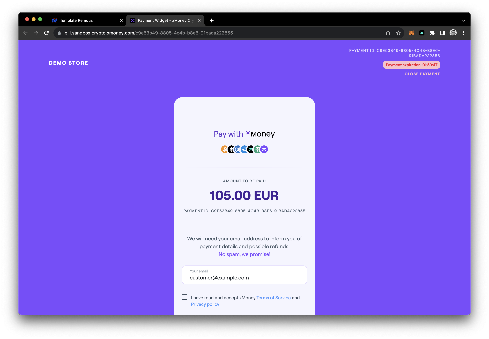

# @multiversx/template-dapp

The **Remotis Portal**, built using [React.js](https://reactjs.org/) and [Typescript](https://www.typescriptlang.org/).
It's a basic implementation of [@multiversx/sdk-dapp](https://www.npmjs.com/package/@multiversx/sdk-dapp), providing the basics for MultiversX authentication and TX signing.

See [Remotis Portal](https://dev.vampirebyte.ro:8000/unlock) for live demo.





## Requirements

- Node.js version 16.20.0+
- Npm version 8.19.4+

### Step 1. Install modules

From a terminal, navigate to the project folder and run:

```bash
yarn install
```

### Step 2. Running in development mode

In the project folder run:

```bash
yarn start:devnet
yarn start:testnet
yarn start:mainnet
``

### Step 3. Build for testing and production use

A build of the app is necessary to deploy for testing purposes or for production use.
To build the project run:

```bash
yarn build:devnet
yarn build:testnet
yarn build:mainnet
```